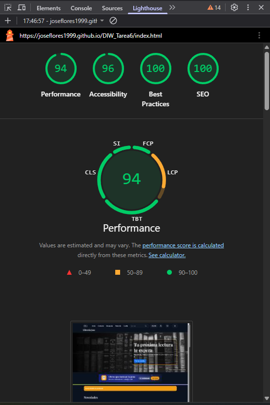

# Librería Jose

Proyecto web de una librería desarrollado para Diseño de Interfaces Web.

La web incluye una página de inicio, ficha de producto, búsqueda, contacto, carrito e información de la tienda.
También incorpora diseño responsive, modo claro/oscuro, animaciones, accesibilidad con teclado, carrusel, acordeón, pestañas, notificaciones y carrito.

## Auditoría Lighthouse

Captura del análisis de accesibilidad realizado a través de Lighthouse:

Autor: José Luis Flores Gálvez
